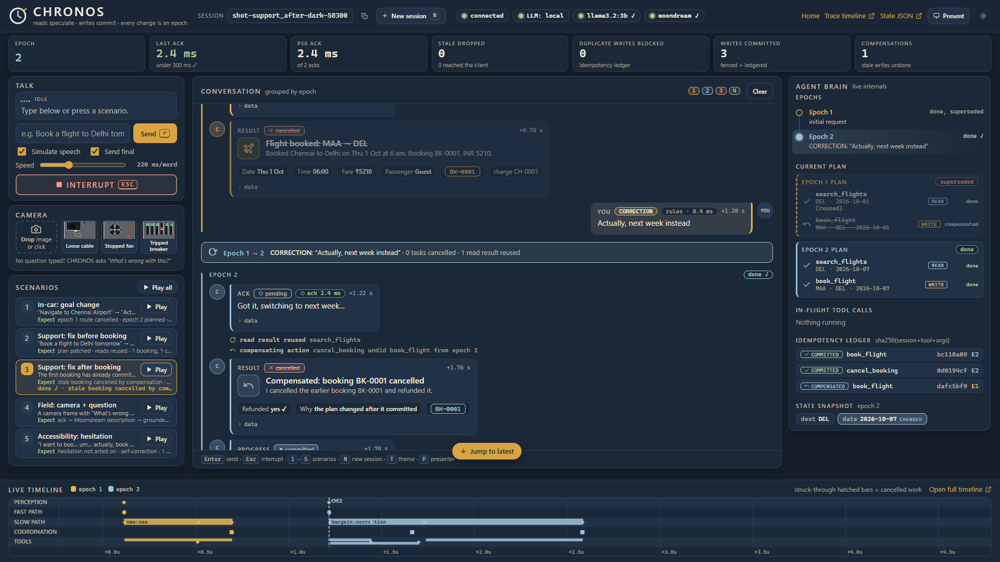
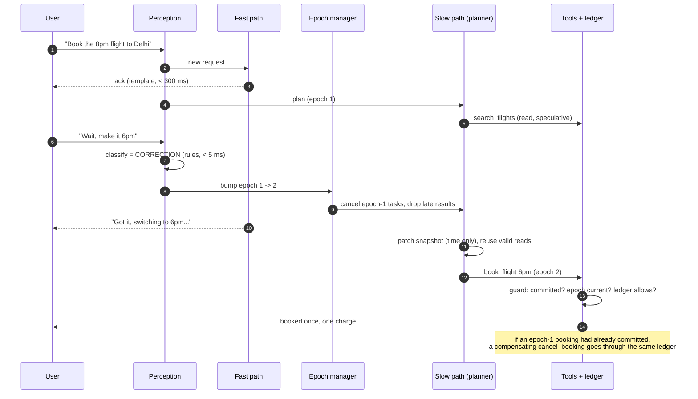
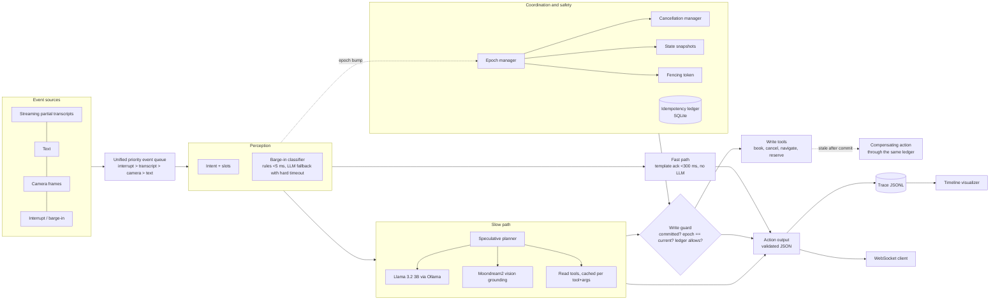

# CHRONOS: an interruptible real-time AI agent

**Team Zenera, SRM Institute of Science and Technology** · Samsung PRISM Generative AI Hackathon, Theme 05


> **Voice agents break when you interrupt them. CHRONOS doesn't.**
> Say *"Book the 8pm flight… wait, make it 6pm"* and CHRONOS cancels the stale work, patches the
> plan, and books **once**. Across 200 randomised interruption scenarios (mock LLM) it left
> **0 duplicate bookings and 0 double charges**, where a plain half-duplex agent double-booked in 9% of them.

**[▶ Watch the prototype demo video](https://drive.google.com/file/d/1XQ9rK0M7CXhwdTMsQRwWkcw7XGgWG09d/view?usp=sharing)**



*The live console in mock-LLM mode: the first booking had already committed, the correction bumps the
epoch, the stale booking is refunded by a compensating action, and exactly one new booking is made.*

## Submission checklist

| Item | Status | Where |
|---|---|---|
| Source code | ✅ | this repository: [chronos/](chronos/), [bench/](bench/), [scenarios/](scenarios/), [web/](web/), [tests/](tests/) |
| Presentation | ✅ | [presentation/presentation.pptx](presentation/presentation.pptx) |
| Video | ✅ | [▶ Watch the prototype demo video](https://drive.google.com/file/d/1XQ9rK0M7CXhwdTMsQRwWkcw7XGgWG09d/view?usp=sharing) |
| AI disclosure | ✅ | [AI_DISCLOSURE.md](AI_DISCLOSURE.md) |
| README | ✅ | this file |
| APK / SDK | ➖ not applicable | CHRONOS is a Python service with a browser client (run it with `python scripts/tasks.py run` or Docker); there is no Android build or SDK package |
| Tag | ✅ | release tag `v1.0.0`; hackathon tag: `Samsung PRISM GenAI Hackathon · Theme 05 · Team Zenera` |

**Tags:** `samsung-prism` `generative-ai` `theme-05` `team-zenera` `interruptible-agent` `barge-in` `real-time` `asyncio` `fastapi` `ollama` `llama3` `moondream` `idempotency` `voice-agent`

## The problem

Voice assistants are half-duplex: listen, think, speak, act, one step at a time. Interrupt one
("Wait! Make it the 6pm flight!") and it ignores you, freezes, or throws everything away and
starts over. Worse, it may execute the stale request as well as the new one, booking the 8pm
*and* the 6pm flight.

## The solution

CHRONOS is full-duplex. It acknowledges you in milliseconds, plans and runs read-only work while you
are still talking, and treats every interruption as a new *version* (epoch) of the task. Work from an
old epoch is cancelled or dropped, still-valid results are reused, and a write can only reach the
outside world if it is committed, current, and not already done. If a write goes stale after it
committed, CHRONOS undoes it with a compensating action.

## Core principle

> **Reads can be speculative; writes must be committed. Every interruption or change creates a new version (epoch).**

## Why this is different

| | Typical voice agent | CHRONOS |
|---|---|---|
| Interruption | ignored, or restarts from scratch | classified in < 5 ms (correction, goal change, addition, cancel, backchannel, hesitation, question) |
| Reply latency | after the model finishes | template acknowledgment in < 300 ms, no LLM call, never claims "done" early |
| Stale work | runs to completion | cancelled per epoch; late results dropped and logged |
| Correction | replan everything | patch the previous state, reuse still-valid speculative reads |
| Writes | fire when planned | guarded: committed plan, current epoch (fenced), idempotency ledger |
| Already-committed stale write | stays booked | undone by a compensating action through the same ledger |
| Hesitation ("um…") | treated as a command | waits, does not act |
| Observability | logs | per-component JSONL traces and a swim-lane timeline visualizer |
| Failure mode | hangs on a slow model | every LLM call has a timeout and a deterministic fallback |

## Try it in 60 seconds

```bash
git clone <this-repo> && cd CHRONOS
python scripts/tasks.py setup          # creates .venv, installs everything
python scripts/tasks.py run            # then open http://localhost:8000
```

No GPU and no Ollama needed: it runs on the deterministic mock LLM by default.

| Page | URL | |
|---|---|---|
| Home | `/` | pitch, animated epoch clip, live benchmark numbers |
| Live demo | `/demo` | text box, simulated mic, camera upload, live JSON feed, 5 one-click scenarios |
| How it works | `/how-it-works` | architecture and the seven steps of an interruption |
| Results | `/results` | CHRONOS vs baseline, read straight from `bench/results.json` |
| Timeline | `/timeline` | pick any session and see what was cancelled |

## What happens when you interrupt



## Architecture



## How the components map to code

| Component | Code |
|---|---|
| Event and output schemas (the single place to match an official spec) | [chronos/protocol.py](chronos/protocol.py) |
| Unified priority event queue | [chronos/events/queue.py](chronos/events/queue.py) |
| Intent and slot extraction (rules first, LLM fallback) | [chronos/perception/intent.py](chronos/perception/intent.py) |
| Barge-in classifier (7 labels, two tiers) | [chronos/perception/bargein.py](chronos/perception/bargein.py) |
| End-of-utterance detection | [chronos/perception/eou.py](chronos/perception/eou.py) |
| Fast path acknowledgments (template, never claims completion) | [chronos/fastpath/ack.py](chronos/fastpath/ack.py) |
| Speculative planner, goals, undo window | [chronos/slowpath/planner.py](chronos/slowpath/planner.py) |
| Local LLM client (mock and Ollama, timeout plus fallback) | [chronos/slowpath/llm.py](chronos/slowpath/llm.py) |
| Vision grounding (mock and Moondream) | [chronos/slowpath/vision.py](chronos/slowpath/vision.py) |
| Epoch manager | [chronos/coordination/epoch.py](chronos/coordination/epoch.py) |
| Cancellation manager, stale-output gate | [chronos/coordination/cancellation.py](chronos/coordination/cancellation.py) |
| Immutable per-epoch state snapshots | [chronos/coordination/snapshot.py](chronos/coordination/snapshot.py) |
| Idempotency ledger (asyncio lock, SQLite) | [chronos/coordination/ledger.py](chronos/coordination/ledger.py) |
| Tool registry, write guard, fencing, compensation | [chronos/tools/registry.py](chronos/tools/registry.py) |
| Read tools / write tools / mock world | [read_tools.py](chronos/tools/read_tools.py) · [write_tools.py](chronos/tools/write_tools.py) · [world.py](chronos/tools/world.py) |
| Session orchestrator | [chronos/agent/session.py](chronos/agent/session.py) |
| FastAPI + WebSocket server | [chronos/api/server.py](chronos/api/server.py) |
| Trace logger, visualizer, offline export | [chronos/trace/](chronos/trace/) |
| Web demo console and site pages | [web/](web/) |
| Benchmark harness | [bench/](bench/) |
| Scripted scenarios (YAML) and their runner | [scenarios/](scenarios/) |

### The write guard

A write tool runs only if all three hold, and the epoch is checked again after the dispatch delay
(a fencing token):

1. the plan is **COMMITTED** (the user finished speaking or confirmed);
2. the write's epoch equals the **current epoch**, checked immediately before dispatch;
3. the **idempotency ledger** allows it. The key is `sha256(session_id + tool + canonical_json(args))`,
   and the write proceeds only if that key is not already COMMITTED or IN_FLIGHT.

A write stopped by the fence is recorded as `BLOCKED` (nothing was written, and it can be retried);
`FAILED` is reserved for real tool errors. A write that turns stale after it committed is undone
through the same ledger (for example `cancel_booking`).

## Setup

### Option 1: Docker (Ollama + models + CHRONOS)

```bash
docker compose up --build
```

This starts `ollama`, runs a one-shot `ollama-init` that pulls `llama3.2:3b` and `moondream` into a
named volume (a multi-GB download the first time only), then starts `chronos` on
<http://localhost:8000>. `chronos` reads `OLLAMA_HOST=http://ollama:11434`. For NVIDIA GPUs, uncomment
the `deploy` block on the `ollama` service.

No GPU or models: `docker compose --profile mock up --build chronos-mock` runs the same image
with the deterministic mock LLM.

### Option 2: Local

Requires Python 3.11.

```bash
python scripts/tasks.py setup        # or: make setup   (creates .venv, installs everything)
ollama pull llama3.2:3b              # optional, only for real-model mode
ollama pull moondream
```

| Command | Same as | What it does |
|---|---|---|
| `make setup` | `python scripts/tasks.py setup` | create `.venv`, install CHRONOS and dev tools |
| `make test` | `python scripts/tasks.py test` | `pytest -q`, then `ruff check` |
| `make run` | `python scripts/tasks.py run` | API and web client on <http://localhost:8000> |
| `make bench` | `python scripts/tasks.py bench` | full benchmark, writes `bench/results.*` and charts |
| `make demo` | `python scripts/tasks.py demo` | plays the 4 scenarios, writes timelines, serves the UI |

`make` is optional. The `scripts/tasks.py` form is identical and works on Windows.

### Mock mode (no GPU, no Ollama)

`CHRONOS_LLM=mock` is the default. The mock LLM is a deterministic rule-based stand-in, so tests,
demos and the benchmark all run on a laptop with nothing installed but Python. Use
`CHRONOS_LLM=ollama` for llama3.2:3b and moondream (`GET /health` reports whether Ollama is reachable
and both models are present).

| Variable | Default | Meaning |
|---|---|---|
| `CHRONOS_LLM` | `mock` | `mock` or `ollama` |
| `OLLAMA_HOST` / `OLLAMA_URL` | `http://localhost:11434` | Ollama endpoint (`OLLAMA_HOST` wins; the scheme is optional) |
| `CHRONOS_LLM_MODEL` / `CHRONOS_VISION_MODEL` | `llama3.2:3b` / `moondream` | model tags |
| `CHRONOS_LLM_TIMEOUT` / `CHRONOS_CLF_TIMEOUT` | `8` / `0.25` s | LLM timeout and barge-in classifier hard timeout |
| `CHRONOS_EOU_MS` | `700` | end-of-utterance silence |
| `CHRONOS_TOOL_LATENCY_MS` | `100,800` | mock tool latency range |
| `CHRONOS_TRACE_DIR` / `CHRONOS_DB` | `traces` / `chronos.db` | trace output and ledger database |

## Running the four demo scenarios

Each scenario is a YAML file in [scenarios/](scenarios/) with an `expect` block (final epoch, live
entities, charges, ledger statuses). The runner plays them against an in-process session:

```bash
python scenarios/run.py              # all five, mock LLM, prints PASS/FAIL per scenario
python scenarios/run.py incar        # one
python scenarios/run.py --llm ollama # with the local models
python scenarios/run.py --html       # also write traces/scn_<name>.html timelines
```

| Scenario | File | What you should see |
|---|---|---|
| 1. In-car | [incar.yaml](scenarios/incar.yaml) | "Navigate to Chennai Airport", then "Actually, gas station first": epoch 1 cancelled, epoch 2 planned, one `set_navigation` |
| 2a. Support, before booking | [support_mid.yaml](scenarios/support_mid.yaml) | "Book a flight to Delhi tomorrow", then "next week instead" mid-search: one booking, one charge |
| 2b. Support, after booking | [support_after.yaml](scenarios/support_after.yaml) | the first booking commits, the correction cancels it by compensating action, and books the new date |
| 3. Field | [field.yaml](scenarios/field.yaml) | a camera frame plus "What is wrong with this machine?": a diagnosis grounded in the image |
| 4. Accessibility | [access.yaml](scenarios/access.yaml) | "I want to boo… um… actually, book a table for 4": hesitation is not acted on, one reservation |

Or click through them in the browser: `make run`, open <http://localhost:8000/demo>, and use the
**Scripted scenarios** buttons (shareable links like `/demo?session=demo1&run=incar` also work).
The client has a text box, a simulated microphone that streams partial transcripts, image upload,
and a live JSON feed.

### API

| | |
|---|---|
| `WS /ws/{session_id}` | send events as JSON, receive protocol messages |
| `POST /sessions/{id}/events` | send one event over HTTP |
| `GET /sessions/{id}/state` | epoch, plan, slots, world, ledger, metrics |
| `GET /traces/{id}` | the JSONL trace |
| `GET /traces/{id}/view` | the trace timeline visualizer |
| `GET /health` | LLM mode and Ollama/model availability |
| `GET /api/results` · `GET /api/traces` | benchmark output and the list of traced sessions (feed the site pages) |

## Trace timeline visualizer

Every component writes structured JSONL to `traces/<session_id>.jsonl`. The visualizer renders it as
swim lanes (Perception / Fast / Slow / Coordination / Tools) on a time axis, coloured by epoch, with
cancelled work struck through.

- **Live:** with the server running, open `http://localhost:8000/traces/<session_id>/view`
  (the session id is shown in the web client).
- **Offline:** `python -m chronos.trace.export traces/<session_id>.jsonl -o timeline.html` produces one
  self-contained HTML file. `python scenarios/record_demo_trace.py` records all four scenarios into
  `traces/demo_all.html`.

In Docker, traces live in the `chronos-data` volume under `/data/traces` and are served by the
`/traces/...` endpoints.

## Benchmarks

`python -m bench.run` runs CHRONOS and a naive half-duplex baseline on the **same** tools, world,
intent rules, LLM and diagnosis code, over N seeded, randomised interruption scenarios (default 200)
drawn from the 4 use cases, with random interrupt timing and random tool latency. All numbers are
measured by the harness from a recording wrapper around the world (ground truth is what the world
actually did, not what an agent says it did). Nothing is hardcoded.

```bash
make bench
# or:  python -m bench.run --n 200 --seed 0 --llm both --concurrency 1 --out bench
```

Outputs: `bench/results.json` (raw per-scenario data), `bench/results.md`, `bench/charts/*.png`.

Result of the run committed with this repo (mock LLM, 200 scenarios per agent, seed 0, one at a
time; Intel i7-13620H, 15.7 GB RAM, Windows 11; brackets are 95% Wilson intervals; full tables and the
per-phase and per-scenario breakdowns are in [bench/results.md](bench/results.md)):

| Metric | CHRONOS | Baseline | Baseline (strict) |
|---|---|---|---|
| Time to first response p50 / p95 / p99 | 1.4 / 5.0 / 5.8 ms | 106 / 281 / 383 ms | 106 / 305 / 392 ms |
| Stale writes stopped before dispatch | 20.3% (12/59) | 53.5% (38/71) | 61.6% (45/73) |
| Stale writes committed, then undone | 79.7% (47/59) | 5.6% (4/71) | 4.1% (3/73) |
| **Stale writes committed and left standing** | **0.0% (0/59)** [0-6] | 25.4% (18/71) [17-37] | 20.5% (15/73) [13-31] |
| **Scenarios with a duplicate live write** | **0.0% (0/200)** [0-2] | 9.0% (18/200) [6-14] | 7.5% (15/200) [5-12] |
| **Scenarios with a double charge** | **0.0% (0/200)** [0-2] | 4.5% (9/200) [2-8] | 4.0% (8/200) [2-8] |
| **Final state consistent with the user's last intent** | **100.0% (200/200)** [98-100] | 91.0% (182/200) [86-94] | 92.5% (185/200) [88-95] |
| Wall-clock per scenario (mean) | 0.37 s | 0.36 s | 0.38 s |

*Baseline (strict)* treats every input, including "okay" and "um", as an interrupt. The plain baseline
gets CHRONOS's noise filter and an "undo the current attempt" concession so it is not a strawman.

How to read this honestly:

- The time-to-first-response gap is by design. CHRONOS acknowledges from a template while the
  half-duplex baseline speaks only after acting. It measures the effect of the acknowledgment, **not**
  faster task completion; the wall-clock row shows completion time is the same.
- The correctness rows are where the epoch/fence/ledger design shows up: the baseline's failures are
  corrections after a commit (its "after" phase is 61% consistent), where a restart forgets the earlier
  write and double-books.
- The Ollama (llama3.2:3b + moondream) pass is implemented (`--llm ollama|both`) but was **not measured
  for the committed results** because Ollama was not installed on the benchmark machine. `results.md`
  says "Not measured"; nothing was estimated.

## Tests

```bash
make test        # pytest -q (354 tests) and ruff check
```

Covers each component, the four end-to-end use cases over HTTP/WebSocket, the trace visualizer's
model (under Node, if installed), the benchmark's metrics and agents, and regressions found by the
benchmark. Everything runs on the mock LLM; no Ollama is needed.

## Limitations

- **Everything is simulated.** Tools are mocks with random latency, speech is scripted text
  (no ASR; the web client streams partial transcripts, it doesn't capture audio), and the benchmark
  scenarios come from a generator written by the same authors as the agent. Real speech would be
  harder for both agents.
- **The mock LLM is rule-based.** Benchmarks with it show the coordination layer, not language-model
  quality. In these scenarios the intent rules understand every utterance; the LLM is exercised only for
  diagnosis. A 3B model on real phrasing will make more classification and slot errors, which the
  hard timeouts and deterministic fallbacks contain but do not remove.
- **Local-model numbers are unmeasured** in the committed results (see above).
- **Benchmark scale:** a few hundred scenarios on one machine; rare-event rates have wide intervals.
  Interrupt phases (before, during, after) are nominal, scheduled from the mean tool latency.
- **Single process, single node.** The idempotency ledger is async-safe within one process and durable
  in SQLite; there is no distributed locking.
- **Compensation is best-effort in the real world.** The mock world can always cancel and refund. Real
  systems may not allow it, which is why the guard prefers stopping a write before dispatch.
- **English only.**

## Roadmap

- Measure and publish the Ollama pass (llama3.2:3b + moondream) on a GPU box.
- Real streaming ASR (for example faster-whisper) in place of scripted transcripts.
- Real tool backends behind the same read/write registry, with per-tool compensation contracts.
- Learned barge-in classifier trained on real conversational audio transcripts.
- Multi-node ledger (shared store) for horizontal scaling.
- Adapt `chronos/protocol.py` to the hackathon's official output spec (it is deliberately a single file).

## Repository layout

```
chronos/     agent, perception, fastpath, slowpath, coordination, tools, trace, api
bench/       baseline agent, scenario generator, metrics, runner, report
scenarios/   YAML demo scenarios, runner, sample camera frames, trace recorder
scripts/     cross-platform task runner used by the Makefile
web/         demo client
tests/       pytest suite
Dockerfile · docker-compose.yml · Makefile · pyproject.toml
```
