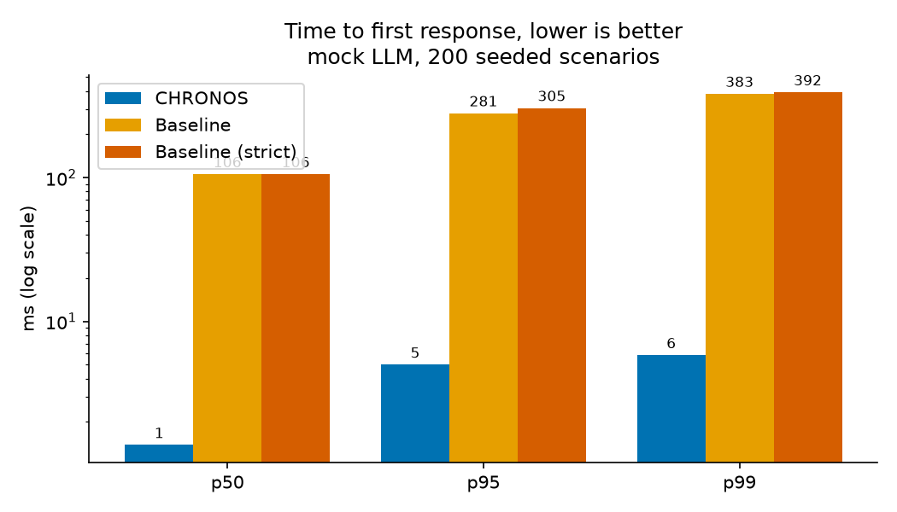
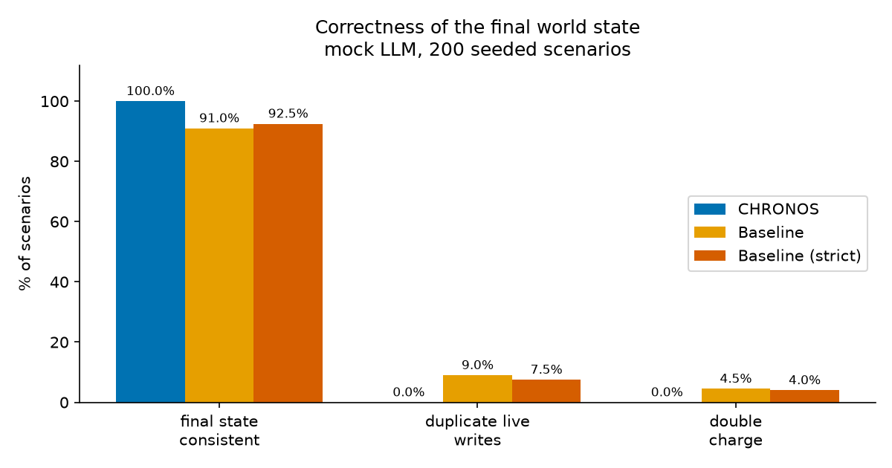
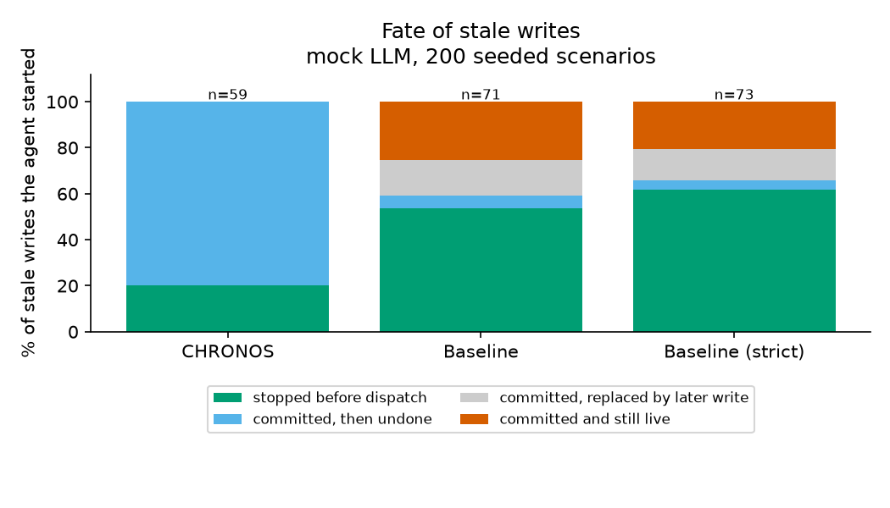
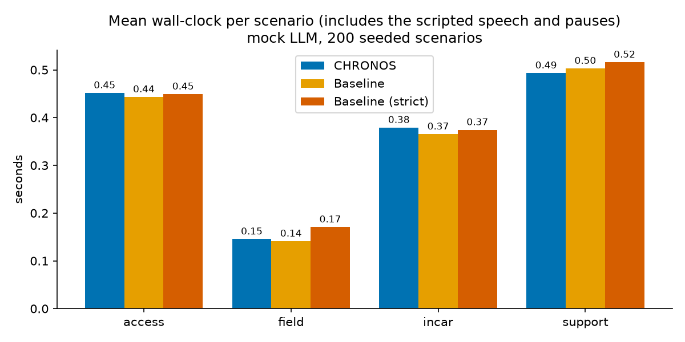

# CHRONOS benchmark results

Generated by `python -m bench.run`; every number below is computed from that run (`python -m bench.run --n 200 --seed 0 --llm both --concurrency 1 --out bench`). Raw per-scenario data is in `results.json`.

## Environment

|  |  |
|---|---|
| OS | Windows-10-10.0.26200-SP0 |
| CPU | 13th Gen Intel(R) Core(TM) i7-13620H (16 logical cores) |
| RAM | 15.7 GB |
| GPU | not probed (only relevant to the Ollama pass) |
| Python / pydantic / fastapi | 3.11.9 / 2.13.5 / 0.141.1 |
| Scenario concurrency | 1 |
| Mean tool latency per scenario | drawn from 20-120 ms (each call 0.5-1.5x that) |
| End-of-utterance silence | 300 ms |
| Seed | 0 |
| Generated (UTC) | 2026-09-29T19:05:42+00:00 |
| Ollama | not reachable at http://localhost:11434 |

## Mock LLM

200 scenarios per agent (use cases: access 50, field 50, incar 50, support 50; interrupt phase: None 52, after 44, before 45, during 59). Elapsed 254.5 s. Brackets are 95% Wilson intervals.

| Metric | CHRONOS | Baseline | Baseline (strict) |
|---|---|---|---|
| **Time to first response** p50 | 1.4 ms | 106 ms | 106 ms |
|   p95 | 5.0 ms | 281 ms | 305 ms |
|   p99 | 5.8 ms | 383 ms | 392 ms |
|   samples / unanswered utterances | 348 / 0 | 348 / 0 | 348 / 0 |
| **Wall-clock per scenario** mean | 0.37 s | 0.36 s | 0.38 s |
|   p95 | 0.84 s | 0.88 s | 0.88 s |
| **Stale writes started** (all scenarios) | 59 in 59 scenarios | 71 in 71 scenarios | 73 in 69 scenarios |
|   stopped before dispatch | 20.3% (12/59) [12-32] | 53.5% (38/71) [42-65] | 61.6% (45/73) [50-72] |
|   committed, then undone | 79.7% (47/59) [68-88] | 5.6% (4/71) [2-14] | 4.1% (3/73) [1-11] |
|   committed, replaced by a later write | 0.0% (0/59) [0-6] | 15.5% (11/71) [9-26] | 13.7% (10/73) [8-23] |
|   **committed and left standing** | 0.0% (0/59) [0-6] | 25.4% (18/71) [17-37] | 20.5% (15/73) [13-31] |
| **Duplicate live writes** (scenarios) | 0.0% (0/200) [0-2] | 9.0% (18/200) [6-14] | 7.5% (15/200) [5-12] |
| **Double charge** (scenarios) | 0.0% (0/200) [0-2] | 4.5% (9/200) [2-8] | 4.0% (8/200) [2-8] |
| **Final state consistent with user's final intent** | 100.0% (200/200) [98-100] | 91.0% (182/200) [86-94] | 92.5% (185/200) [88-95] |
| World reads / committed writes per scenario | 1.57 / 1.12 | 1.1 / 0.83 | 1.19 / 0.81 |
| Errors or timeouts | 0 | 0 | 0 |
| Stale-epoch outputs emitted (CHRONOS invariant) | 0 | n/a | n/a |

**By use case**: final state consistent

|  | scenarios | CHRONOS | Baseline | Baseline (strict) |
|---|---|---|---|---|
| access | 50 | 100% (50/50) | 82% (41/50) | 86% (43/50) |
| field | 50 | 100% (50/50) | 100% (50/50) | 100% (50/50) |
| incar | 50 | 100% (50/50) | 100% (50/50) | 100% (50/50) |
| support | 50 | 100% (50/50) | 82% (41/50) | 84% (42/50) |

**By interrupt phase (nominal, see notes)**: final state consistent

|  | scenarios | CHRONOS | Baseline | Baseline (strict) |
|---|---|---|---|---|
| None | 52 | 100% (52/52) | 100% (52/52) | 100% (52/52) |
| after | 44 | 100% (44/44) | 61% (27/44) | 68% (30/44) |
| before | 45 | 100% (45/45) | 100% (45/45) | 100% (45/45) |
| during | 59 | 100% (59/59) | 98% (58/59) | 98% (58/59) |

**By scenario variant**: final state consistent

|  | scenarios | CHRONOS | Baseline | Baseline (strict) |
|---|---|---|---|---|
| access/cancel | 6 | 100% (6/6) | 100% (6/6) | 100% (6/6) |
| access/hesitate_then_request | 16 | 100% (16/16) | 100% (16/16) | 100% (16/16) |
| access/request_then_fix | 28 | 100% (28/28) | 68% (19/28) | 75% (21/28) |
| field/control | 22 | 100% (22/22) | 100% (22/22) | 100% (22/22) |
| field/swap | 28 | 100% (28/28) | 100% (28/28) | 100% (28/28) |
| incar/cancel | 5 | 100% (5/5) | 100% (5/5) | 100% (5/5) |
| incar/control | 4 | 100% (4/4) | 100% (4/4) | 100% (4/4) |
| incar/goal_change | 41 | 100% (41/41) | 100% (41/41) | 100% (41/41) |
| support/cancel | 9 | 100% (9/9) | 100% (9/9) | 100% (9/9) |
| support/control | 10 | 100% (10/10) | 100% (10/10) | 100% (10/10) |
| support/date_fix | 14 | 100% (14/14) | 71% (10/14) | 71% (10/14) |
| support/time_fix | 17 | 100% (17/17) | 71% (12/17) | 76% (13/17) |

**Scenarios CHRONOS got wrong**

CHRONOS had no inconsistent scenarios in this run.

Baseline: 18 inconsistent scenario(s); first 4:

- scenario 3 (access/request_then_fix, phase during): 2 live reservations, expected 1
- scenario 9 (support/date_fix, phase after): 2 live bookings, expected 1
- scenario 23 (access/request_then_fix, phase after): 2 live reservations, expected 1
- scenario 29 (support/date_fix, phase after): 2 live bookings, expected 1

Baseline (strict): 15 inconsistent scenario(s); first 4:

- scenario 3 (access/request_then_fix, phase during): 2 live reservations, expected 1
- scenario 9 (support/date_fix, phase after): 2 live bookings, expected 1
- scenario 23 (access/request_then_fix, phase after): 2 live reservations, expected 1
- scenario 29 (support/date_fix, phase after): 2 live bookings, expected 1

## Local LLM (Ollama: llama3.2:3b + moondream)

**Not measured.** Ollama is not reachable at http://localhost:11434. No numbers are reported for this configuration; none were estimated or carried over from the mock run.

## What was measured, and what these numbers do and do not mean

**Definitions.** *Time to first response* is measured per actionable utterance: milliseconds from
the moment it is sent until the agent emits any message. CHRONOS emits an acknowledgment from its
deterministic fast path; the half-duplex baseline speaks only after it has finished acting, so this
metric shows the effect of the acknowledgment, not faster task completion. Task completion is the
*wall-clock* row (which includes the scripted speech and pauses, identical for every agent).
A *stale write* is a write attempt whose arguments do not match the user's final intent; what
happened to each one is read from the world's own call log (a recording wrapper around the mock
world), not from the agent's bookkeeping. *Duplicate writes*, *double charge* and *consistency* are
read from the final world state against a per-scenario oracle, and consistency also requires the
world's invariants to hold and, for troubleshooting, the last diagnosis to match the last frame.

**Agents.** All agents share the same world, tools and argument schemas, intent and slot rules,
LLM and vision clients, diagnosis code, and (rule-based) utterance labelling. The baseline is
sequential and half-duplex: it acts only on complete utterances, speaks only after acting, and on an
interrupt cancels what is in flight and restarts the goal. It has no speculation, epochs, fencing
token, idempotency ledger, read cache, or compensation of stale writes. To avoid a strawman it
gets two concessions: it ignores "okay"/"um" using CHRONOS's own rules, and on "cancel that" it
undoes the writes it remembers from the current attempt. *Baseline (strict)* drops the first
concession: every input is treated as an interrupt. The world is transactional, so cancelling a
baseline mid-write rolls back rather than corrupting; the baseline's failures come from timing,
not from a broken database.

**Limits you should state alongside these numbers.**
- Everything is simulated: tool latency is random sleep (not real services), speech is scripted
  text (no ASR), and scenarios come from a generator written by the same authors as the agent, so
  the oracle and the phrasing reflect what the rules were built to understand. Real user speech
  would be harder for both agents.
- The *mock* LLM is deterministic and rule-based. With it, results show the effect of the
  coordination layer, not language-model quality; in these scenarios the intent rules handle
  every utterance, so the LLM is exercised only for the troubleshooting diagnosis.
- Interrupt phases (before/during/after) are *nominal*: they are scheduled from the mean tool
  latency, and each call's latency varies, so a "during" scenario can land slightly earlier or
  later. Use the phase breakdown to see trends, not exact boundaries.
- Percentages come from a few hundred scenarios; the brackets are 95% Wilson intervals. Small
  tail counts (p99, rare failures) are noisy.
- Timing was taken on one machine with scenarios run one at a time (concurrency shown above), so
  absolute milliseconds will differ elsewhere; the comparison between agents on the same run is
  the meaningful part. Idle detection polls at ~20 ms, so wall-clock is taken from the last
  observed activity instead.
